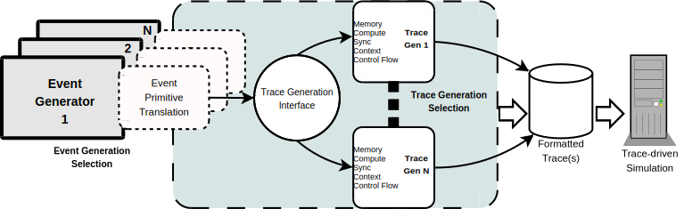

Developer Documentation
=======================

.. todo:: section for developers

          event primitives in depth

          section for backend writing/multithreaded

          frontend event generation

          frontend IPC

          frontend synchronization capture

   Sigil2 Flow from Frontend to Backend

   Legend

