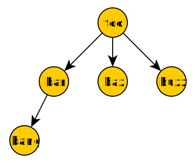

Overview
========

|project| is a framework designed to help analyze dynamic behavior in applications.
This dynamic behavior, or **workload**, is a result of the application
and its given inputs and state.

Workloads
---------
One of the main goals behind |project| is providing a straightforward interface
to intuitively represent and analyze workloads.
A workload can be represented in many ways.
Each way has different requirements. 

For example, you can represent a workload as a simple assembly instruction trace...:

.. code-block:: gas

   push   %rbp
   push   %rbx
   mov    %rsi,%rbp
   mov    %edi,%ebx
   sub    $0x8,%rsp
   callq  4377b0 <_Z17myfuncv>
   callq  4261e0 <_ZN5myotherfunc>
   mov    %rbp,%rdx
   mov    %ebx,%esi
   mov    %rax,%rdi
   callq  422460 <_ZN5GO>
   add    $0x8,%rsp
   xor    %eax,%eax
   pop    %rbx
   pop    %rbp
   retq

...or a call graph...:

...or a memory trace...:

.. code-block:: none

   ADDR         BYTES
   0xdeadbeef   8
   0x12345678   4
   0x00000000   1
   ...

...or more complex representations.
Fundamentally, all workload representations can be broken down into five
*event primitives*.

Event Primitives
^^^^^^^^^^^^^^^^

Because of the variety of use-cases being supported,
|project| presents workloads as a set of extensible primitives.

+-----------------+-----------------------------------------+
| Event Primitive | Description                             |
+=================+=========================================+
| Compute         | some transformation of data             |
+-----------------+-----------------------------------------+
| Memory          | some movement of data                   |
+-----------------+-----------------------------------------+
| Control Flow    | divergence in an event stream           |
+-----------------+-----------------------------------------+
| Synchronization | ordering between separate event streams |
+-----------------+-----------------------------------------+
| Context         | grouping of events                      |
+-----------------+-----------------------------------------+

E.g., an abstract workload is represented as: ::

  ...
  compute     FLOP,   add,   SIMD4
  memory      write,  4B,    <addr1>
  memory      read,   16B,   <addr2>
  context     func,   enter, hello_world_thread
  sync        create, <TID1>
  ...

.. detail a formalized structure

Event Generation
----------------

Many tools exist to capture workloads.
Currently, Valgrind_ is well supported.
DynamoRIO_ is on its way to good support, and we are experimenting with traces
captured with hardware features.

Eventually, we aim to support a broad spectrum of tools to support many applications
and hardware architectures, e.g.:

* static instrumentation tools

  * PEBIL_
  * LLVM_ (e.g. Contech_)

* :abbr:`dynamic binary instrumentation (DBI)` tools

  * Valgrind_
  * DynamoRIO_
  * PIN_
  * GPGPU specific

* :abbr:`hardware performance counter (HPC)` sampling

  * architecture-specific

* simulation probes

  * gem5_
  * SniperSim_
  * Multi2Sim_

* and others

.. _PEBIL: http://www.sdsc.edu/pmac/tools/pebil.html
.. _LLVM: http://llvm.org
.. _Contech: http://bprail.github.io/contech/
.. _Valgrind: http://valgrind.org
.. _DynamoRIO: http://dynamorio.org
.. _PIN: https://software.intel.com/en-us/articles/pin-a-dynamic-binary-instrumentation-tool
.. _gem5: http://www.gem5.org/Main_Page
.. _SniperSim: http://snipersim.org/
.. _Multi2Sim: http://www.multi2sim.org/

Each framework has its merits depending on the desired granularity and source of the event trace.
Most binary instrumentation frameworks do a good job of obvserving the instruction stream of general
purpose CPU workloads, but incur large overheads and may perturb results.
Hardware support is good for real-time capture, but may have trouble capturing a native sized
workload.
Execution-driven simulators are great for fine-grained, low-level traces, but simulation time
may be intractable for very large workloads, and simulators obviously must support the application.
Additional capture methodologies exist for applications designed in interpreted or managed languages.

|project| recognizes these trade-offs and creates an abstraction to the underlying
framework that observes the workload.
Events are *translated* into |project| *event primitives*, which are then presented to the user
for further analysis or simple trace-generation.
The component used in a given framework for event generation is a |project| **frontend**,
and the user-defined analysis or trace-generation on those events is a |project| **backend**.
Currently, backends are written as C++ static plugins to |project|.
We are interested in expanding support to C++ dynamic libraries and additionally python bindings.
